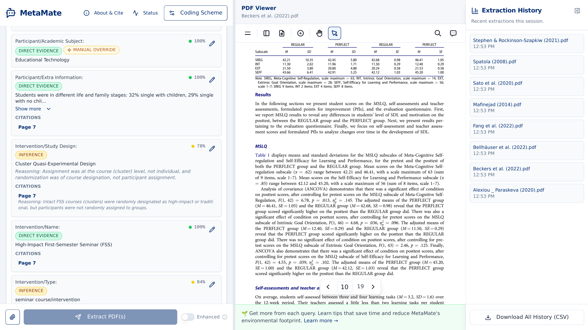

<div align="center">


# MetaMate

**AI-assisted data extraction for educational systematic reviews and meta-analyses.**

[](LICENSE)
[](https://doi.org/10.1145/3772363.3798755)

</div>



## Why MetaMate?

Data extraction is one of the most time-consuming steps in a systematic review or meta-analysis — manually locating and coding sample sizes, study designs, and intervention details across dozens of papers.

MetaMate uses AI to generate a first draft of your extraction, then gives you the tools to verify every value: confidence scores, evidence type indicators, page citations, and a synchronized PDF viewer — all in one interface. Define your own coding scheme, verify the results, and export to CSV. No programming required.

## Features

- **Researcher-defined coding schemes** — not limited to PICO; supports any variables relevant to your review
- **Confidence scores** and evidence type indicators (Direct Evidence vs. Inference) for each extracted value
- **Synchronized PDF viewer** for side-by-side verification of extracted data
- **Page-level citations** linking each value back to the source text
- **CSV export** for use with your statistical analysis software
- **Batch processing** across multiple PDFs

## Getting Started

[](https://metamate.online)

No installation needed — just open the link above and start extracting.

<details>
<summary><strong>Run locally with Docker</strong></summary>

#### 1. Install Docker

Download and install [Docker Desktop](https://www.docker.com/products/docker-desktop/) and make sure it's running.

#### 2. Get an LLM API key

You need an API key from an LLM provider. [OpenAI](https://platform.openai.com/api-keys) is the default.

#### 3. Download and run MetaMate

Open a terminal (Mac: Terminal app, Windows: PowerShell) and run:

```bash
git clone https://github.com/GaoxiangLuo/OpenMetaMate.git
cd OpenMetaMate
cp .env.example .env
```

Open the `.env` file in a text editor and replace `sk-proj-your-api-key-here` with your API key from step 2. Then start the application:

```bash
docker-compose up --build
```

Once you see the services are running, open [http://localhost:3000](http://localhost:3000) in your browser.

To stop, press `Ctrl+C` in the terminal, then run:
```bash
docker-compose down
```

**Supported LLM providers**: OpenAI, Google (Gemini), OpenRouter, or any OpenAI-compatible API (vLLM, Ollama, etc.). See [`.env.example`](.env.example) for all configuration options.

</details>

<details>
<summary><strong>Manual setup (without Docker)</strong></summary>

```bash
# Backend
cd backend
pip install uv && uv sync
uv run uvicorn app.main:app --reload --port 8000

# Frontend (in a new terminal)
cd frontend
pnpm install && pnpm dev
```

</details>

## Citation

If you use MetaMate in your research, please cite:

```bibtex
@inproceedings{10.1145/3772363.3798755,
  author    = {Wang, Xue and Luo, Gaoxiang},
  title     = {MetaMate: Understanding How Educational Researchers Experience AI-Assisted Data Extraction for Systematic Reviews},
  year      = {2026},
  publisher = {Association for Computing Machinery},
  address   = {New York, NY, USA},
  url       = {https://doi.org/10.1145/3772363.3798755},
  doi       = {10.1145/3772363.3798755},
  booktitle = {Proceedings of the Extended Abstracts of the CHI Conference on Human Factors in Computing Systems},
  series    = {CHI EA '26}
}
```

## Documentation

| Document | Description |
|----------|-------------|
| [Contributing Guide](CONTRIBUTING.md) | How to contribute, code standards, PR process |
| [Cloud Deployment](docs/deployment.md) | Self-hosting on AWS with Terraform |
| [Infrastructure](infra/README.md) | Terraform configuration reference |

<details>
<summary><strong>Project Structure</strong></summary>

```
OpenMetaMate/
├── backend/               # FastAPI backend
│   ├── app/
│   │   ├── api/routes/    # API endpoints
│   │   ├── core/          # Configuration & exceptions
│   │   ├── models/        # Pydantic schemas
│   │   └── services/      # LLM, PDF processing, S3
│   ├── pyproject.toml
│   └── Dockerfile
├── frontend/              # Next.js frontend
│   ├── app/               # App Router pages
│   ├── components/        # React components
│   ├── lib/               # API client, types, utilities
│   └── Dockerfile
├── infra/                 # Terraform IaC
├── docs/                  # Extended documentation
├── plans/                 # Architecture decision records
├── docker-compose.yml
└── .env.example
```

</details>

## Contributing

We welcome contributions! See our [Contributing Guide](CONTRIBUTING.md) for the development workflow, code standards, and PR process.

## License

MIT License — see [LICENSE](LICENSE)
